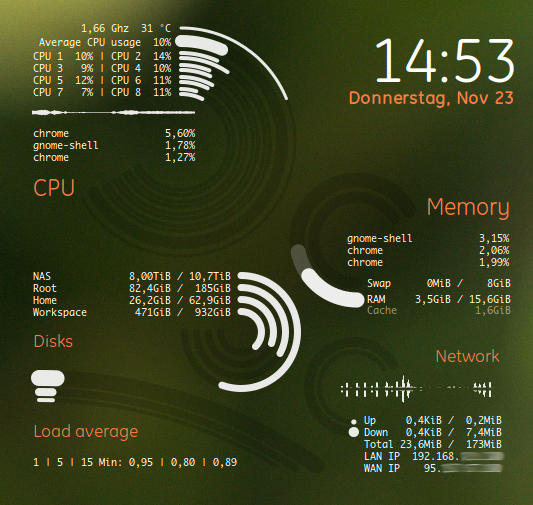
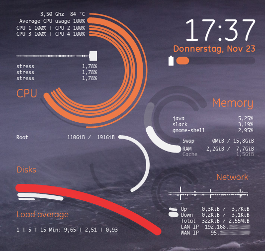
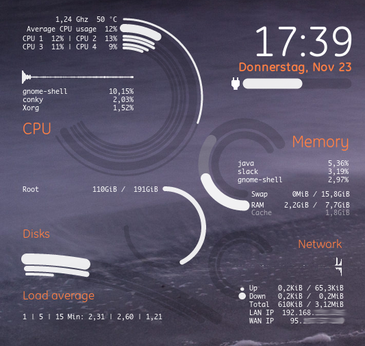
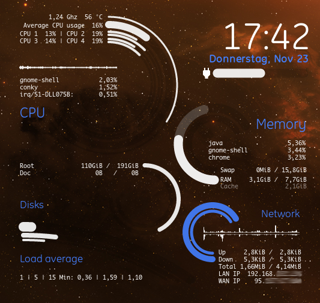

# miracle-conky-i9

I am starting with miracle-conky as my base for a project to learn LUA, Cairo and some other stuff.
https://github.com/tflori/miracle-conky

## Requirements

This conky configuration needs a conky with lua support and the libraries cairo and imlib2.

I tested on Pop!\_OS.

## Install

Clone or download this repository and execute the `start.sh`.

## Screenshots

  
  
  
  

## License

This configuration is shared under [MIT License](LICENSE). You can share and redistribute.

The Icons used for the battery bar are from [Material Icons](https://github.com/google/material-design-icons/)
- thanks to the contributors.
